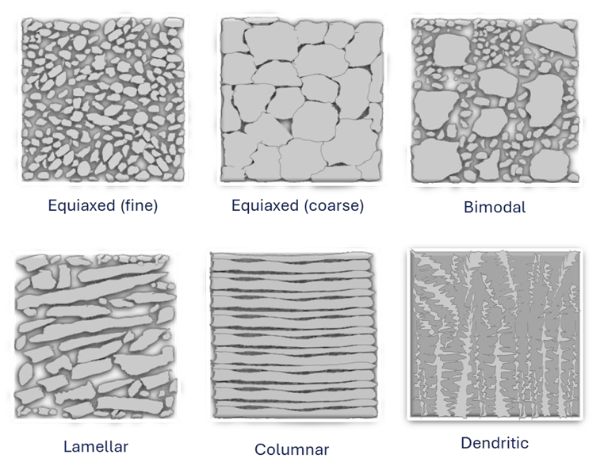
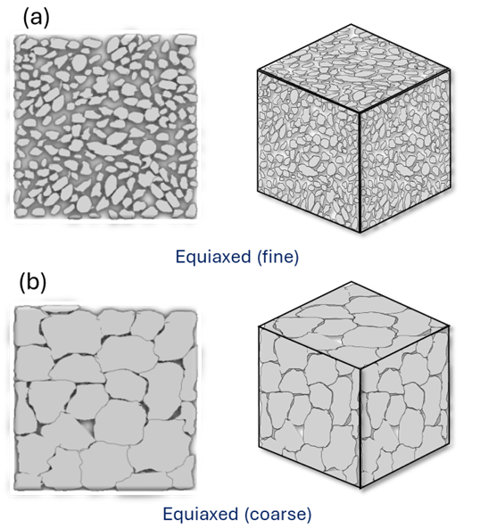
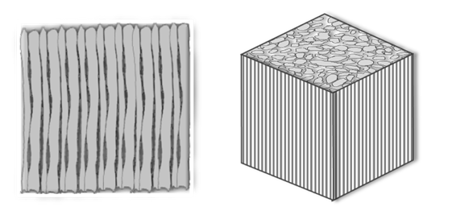
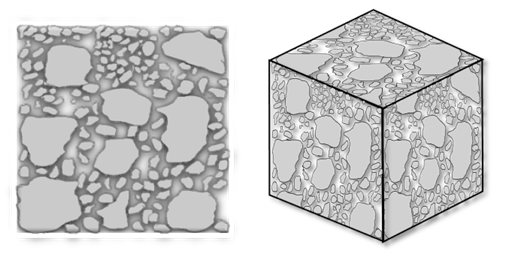
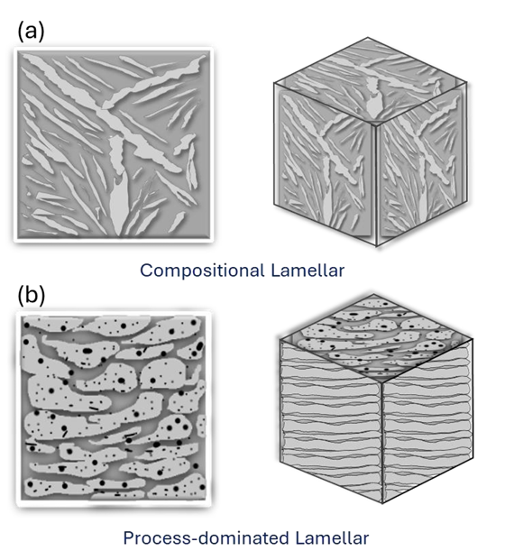
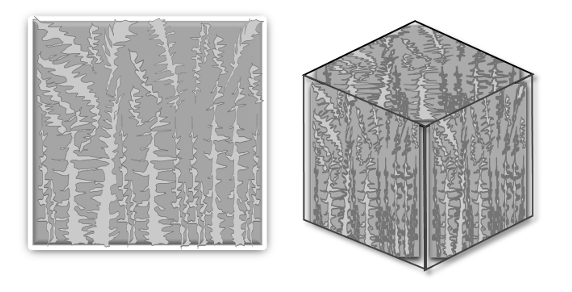
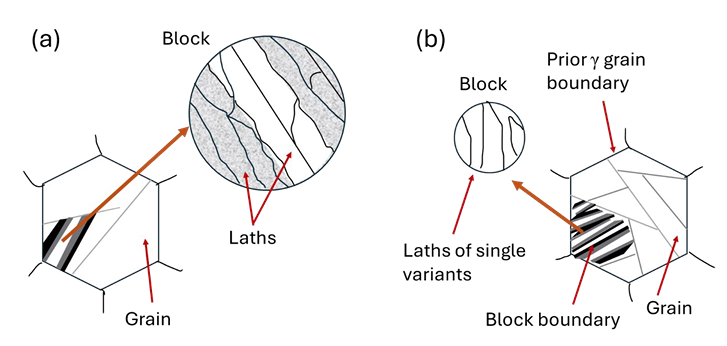

Characterization of materials (mainly metals and ceramics involve reporting the phase fraction (in composites, covered as Experiment 8) and grain size (of phase, covered as Experiment 9).  

Microstructure of crystalline material (viz. metals and ceramics) comprises of three-dimensional arrangement of grains that are formed either via solid-state sintering or by solidification of material. 
The crystallites nucleate during solidification and grow as the temperature decreases. The impingement of these crystallites during its growth is impeded by presence of other crystallite resulting in an interface called as grain boundary. Grain boundary is a 2-dimensional surface, the largely governs the strength of material by limiting the grain size. Imperfections therein restrict the movement of dislocation as slip-orientation must change and overcome the easy-slip system in the 
existing grain.   

Grain also include various phases (say in a composite material), porosity (if any) and defects therein. Microstructure of material is greatly affected by thermomechanical treatments (or say heat treatment and/or mechanical processing of material). Further, the residual stresses may alter the lattice parameter and/or permit presence of metastable phases. Thus, grain microstructure provides a good insight into the material behavior.  
 
A variety of types of grains are formed (Fig. 1), as also discussed herewith: 
 
Figure 1: Types of microstructures in a metal/ceramic showing equiaxed, bi-modal, lamellar, columnar and dendritic type of grain microstructures..   

Microstructure can be of following types:  
<b>1. Equiaxed grains: </b> 
Equiaxed grains, Fig. 2, are randomly oriented where the grain boundaries meet at various angles. Homogenization and uniform slower/rapid cooling results in all the grains acquiring similar size (or becoming ‘isotropic’) from the provided heat treatment. Processes that cool the surface rapidly results finer equiaxed grain size, Fig. 2a, on the surface, whereas coarse (and columnar) grains, Fig. 2b, result by growth in direction opposite to that of heat extraction. Smaller size grains (called ‘fine grains’) are usually stronger and tougher, whereas 
bigger size grains (called ‘coarse grains) are usually weaker and less tough. Nonetheless, coarse grains are resistant to crack initiation during fatigue, whereas coarse grains perform better against fatigue crack propagation. 
 
Figure 2: Equiaxed microstructure showing grains of similar size (though the grains itself can be fine or coarse) as presented. 

<b>2. Columnar grains: </b> 
Columnar grains are elongated grains, Fig. 3, formed in the direction opposite to that of heat extraction. The preference of growth in a particular orientation (or resulting ‘anisotropy’) makes it stronger in that direction (for structural application, such as thermal barrier 
coatings) and permits strain accommodations in direction perpendicular to the same (i.e. perpendicular to longer axis).   
 
Figure 3: Columnar grain microstructure showing elongated nature of grains. 

<b>3. Bimodal grains: </b> 
When the microstructure shows grain size distribution centered around two different grain sizes, the structure is ‘bimodal grain size’, Fig. 4. In such a case, the microstructure hints at stronger and tougher material response that is built on sharing stress on the bigger grain sizes acting as scaffolds for structural integrity, and sharing strain on the smaller grain sizes acting as free surfaces for providing structural compliance, thereby enhancing the overall toughness. In addition, the bigger grains provide the required stiffness, whereas emanating cracks get terminated on the free surfaces provided by the fine-grained regions, thereby also enhancing the material toughness.    
 
Figure 4: Bimodal microstructure showing size of grains centered around two different sizes (i.e. one smaller-sized and other bigger-sized).  

<b>4. Lamellar grains: </b> 
The grains can be planar (or lamellae) that provide layer-like behavior due to compositional variation (Fig. 5a) and/or in response to the nature of the deposition process to form a coating (Fig. 5b). The compositional variation can be appreciated in the pearlite structure of 
steel, whereas process-governed nature in a coating is typical in plasma spray deposition resulting lamellae structure. Compositional variation, Fig. 5a, in lamellae (i.e. ferrite and cementite in pearlitic structure) permits arrangement that is layer-like and enhances the material strength via composite formation. The process-dependent variation, Fig. 5b, can either deposit one or multiple type of material to form splats, and result lamellae (sheet-like structure) that provide anisotropic behavior (such as thermal resistance) to the deposited coating structure.    
 
Figure 5: Lamellar structure arising from the variation in: a) Compositional variation in the phases, and (b) process-dominated that deposits layer-by-layer structure to form the coating. 

<b>5. Dendritic grains:</b> 
Dendritic grains (or tree-like grains), Fig. 6, result from the constitutional undercooling that permits growth along the cooling direction (or against the heat-flow direction). The column has primary arm, which splits onto secondary or tertiary arms as the heat extraction is permitted along the primary columns and secondary columns, respectively. Undercooling of the melt becomes the driving force 
that provides the required free energy difference to overcome the nucleation barrier. As the surface energy barrier is anisotropic in nature (i.e. dependent on the planar atomic density), only certain 
growth direction are favored during solidification. These energetically favored directions align along the cooling direction and grow at rates determined through constitutional undercooling. Cooling conditions must be appropriate to result constitutional undercooling (dependent on the 
composition, or throwing of solute in the liquid, during the range of solidification temperature in an alloy, becoming richer in lower-melting material). Apparently, a pure material can not result a dendritic structure as there is no other phase and solidification occurs at an instant.  
 
Figure 6: Formation of dendrites (or tree-like structure) due to constitutional undercooling in an allow. 

<b>6. Lath type grains </b> 
Small packets/blocks are formed within a coarse structure (i.e. martensite forming as laths in a prior austenite grains) that can be fine (≈50-500 nm) or coarse (few µm thick), Fig. 7a, that are large and 
boundary-free regions. Lath structures align parallel to one another across a large region and provide a characteristic microstructure. The morphology of these blocks becomes fine (≈200-500 nm), Fig. 7b 
with increasing carbon content (up to 0.8%C), and becomes difficult to resolve in optical microscope. Further, the strength and toughness of martensitic steel is strongly governed by the size of the lath.  
 
Figure 7: Lath structure in a) lower C content (0.4%C), and b) higher carbon content (0.6%C) of steels. 

